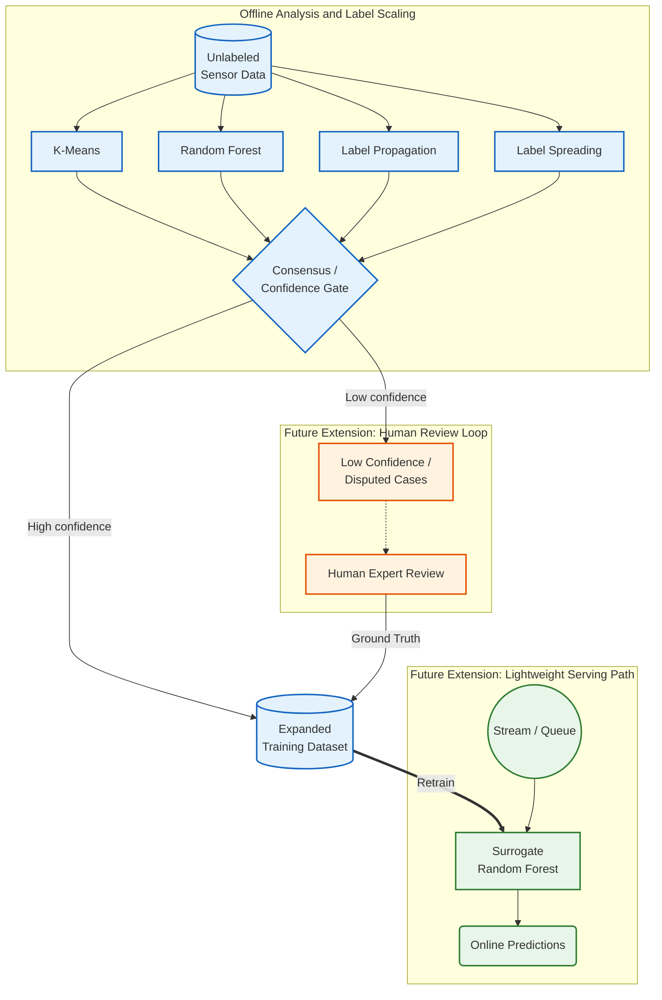
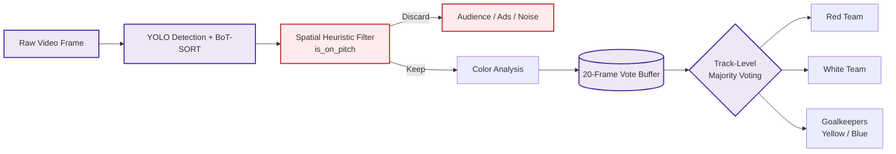
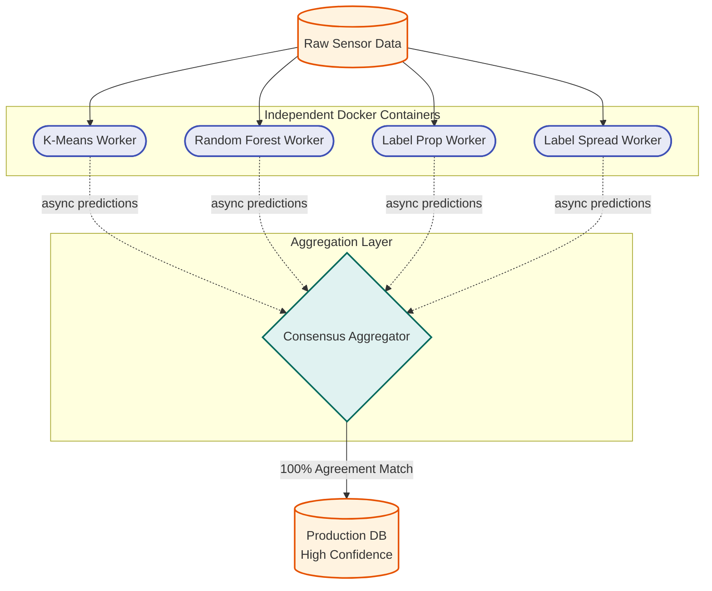

# Machine Learning and Computer Vision Projects

This repository contains two case-study style projects:

1. `sensor_anomaly_detection/`: semi-supervised classification with limited labels.
2. `sports_player_tracking/`: offline sports video analysis with detection, tracking, and team-color heuristics.

The emphasis is on demonstrating practical machine learning and computer vision skills through end-to-end project work.

## Core Skills Demonstrated

| Skill area | Demonstrated in repository |
| --- | --- |
| Semi-supervised learning | Sensor anomaly detection pipeline with sparse labels |
| Feature selection | F-test, Random Forest importance, SHAP |
| Classical ML modeling | K-Means, Label Spreading, Label Propagation, Random Forest |
| Model export and inference | Serialized scaler/model artifacts and batch inference script |
| Computer vision pipeline design | YOLO + BoT-SORT + post-processing heuristics |
| Temporal stabilization | Track-level majority voting and smoothing |
| Reproducibility | Local scripts, Dockerfiles, Makefile, lightweight tests |

## Repository Scope

- The repository focuses on implemented project work and technical decisions.
- It does not include a full production serving stack or cloud deployment implementation.
- It does not include labeled benchmark annotations for formal tracking metrics such as MOTA, IDF1, or HOTA.

## Project 1: Sensor Anomaly Detection

**Focus**: semi-supervised learning, feature selection, interpretable model comparison

### Implemented

- Dataset with 1,600 rows, 20 sensor features, and 40 labeled samples (2.5%).
- Training and analysis script comparing K-Means, Label Spreading, Label Propagation, and Random Forest.
- Feature selection pipeline using F-test, Random Forest feature importance, and SHAP.
- Export of a fitted `StandardScaler` and `RandomForestClassifier` to `artifacts/`.
- Batch and interactive inference entry point in `predict.py`.
- Dockerfile for running the offline training pipeline as a containerized batch job.

### Architecture Sketch

The diagram below is worth keeping because it explains the problem framing well.
To be precise:

- The offline analysis and model export parts are implemented in this repository.
- The human review loop, streaming ingestion, and scheduled retraining are architecture extensions, not implemented services in this repo.



### Verified Local Results

These are the results produced by `sensor_anomaly_detection/sensor_clustering.py` in this repository:

- `LabelSpreading`: 92.5% 5-fold CV accuracy on the 40 labeled samples.
- `RandomForest`: 87.5% mean 5-fold CV accuracy on the 40 labeled samples.
- `LabelPropagation`: 100% CV accuracy on the 40 labeled samples on this dataset.

Important caveat:

- The dataset is very small on the labeled side.
- There is no independent holdout test set.
- `LabelPropagation` emitted convergence warnings during local verification.

Treat these numbers as exploratory results on the included dataset, not as definitive production benchmarks.

### Run

```bash
python3 sensor_anomaly_detection/sensor_clustering.py
python3 sensor_anomaly_detection/predict.py --csv sensor_anomaly_detection/data_sensors.csv
```

Or use the root `Makefile`:

```bash
make sensor-train
make sensor-predict
```

### Limitations

- Training logic is still organized as a script, not as a reusable package.
- Validation is based on cross-validation over 40 labeled examples, which is not enough for production claims.
- No schema versioning or model registry is implemented.
- The exported inference path is local-file based, not served behind an API.

## Project 2: Sports Player Tracking

**Focus**: object detection, tracking, temporal smoothing, color-based post-processing

### Implemented

- Offline video pipeline using YOLO + BoT-SORT tracking.
- Spatial filtering with `is_on_pitch` to suppress spectators and visual artifacts.
- Track-level voting to stabilize team labels across frames.
- Color heuristics for red team, white team, yellow goalkeeper, and blue goalkeeper.
- Annotated MP4 and CSV outputs for a demo video.
- Separate evaluation script for the first 100 frames of the sample video.
- Dockerfile for packaging the local inference/demo runner.

### Pipeline Diagram

This diagram reflects the actual video-processing pipeline in the repository at a high level:



### Verified Local Results

A local run of `sports_player_tracking/eval_c_100frames.py` on the included `sample.mp4` produced:

- Red team average count: `4.0`
- White team average count: `5.7`
- Yellow goalkeeper average count: `0.8`
- Blue goalkeeper average count: `0.0`
- Total detections average: `10.5`

These numbers only describe the pipeline's outputs on the sample video. They are not benchmark metrics because the repo does not include frame-level ground truth annotations.

### Run

```bash
python3 sports_player_tracking/eval_c_100frames.py
python3 sports_player_tracking/solution.py
```

Or use the root `Makefile`:

```bash
make sports-eval
make sports-track
```

### Limitations

- Evaluation is descriptive only; there is no labeled benchmark set in the repo.
- Color thresholds are hand-tuned for the included sample and similar footage.
- The pipeline is a local demo, not a deployed streaming system.
- Pretrained weights are large local assets, which is convenient for local reproducibility but not ideal long-term repository hygiene.

## Minimal Verification

The repository now includes lightweight automated tests for the sensor inference path:

```bash
python3 -m unittest discover -s tests -v
```

Or:

```bash
make test
```

## Repository Layout

```text
.
├── Makefile
├── README.md
├── tests/
├── sensor_anomaly_detection/
│   ├── predict.py
│   ├── sensor_clustering.py
│   ├── data_sensors.csv
│   ├── artifacts/
│   └── Dockerfile
└── sports_player_tracking/
    ├── solution.py
    ├── eval_c_100frames.py
    ├── sample.mp4
    ├── models/
    └── Dockerfile
```

## Production Gap Checklist

If this repo were to become production-ready, the next engineering steps would be:

1. Add proper train/validation/test splits and stronger statistical evaluation.
2. Turn both projects into reusable packages with configuration files instead of hard-coded thresholds.
3. Add CI, linting, type checks, and a stricter test suite.
4. **Decompose the consensus pipeline** into distributed microservices (1 model per container) rather than a monolithic script.
5. Introduce explicit service boundaries for inference, model versioning, and observability.
6. Remove generated artifacts from version control and manage large binaries with a better asset strategy.

## Extrapolated Distributed Architecture

While the code currently evaluates all four models in a single `sensor_clustering.py` script for simplicity, the target production architecture isolates each algorithm into an independent Docker container. This ensures computational faults (like out-of-memory errors in graph-based Label Propagation) do not cascade and crash the whole pipeline.

An explicit `docker-compose.yml` blueprint is provided in `sensor_anomaly_detection/` to demonstrate this decoupled, 1-model-per-container architecture.


