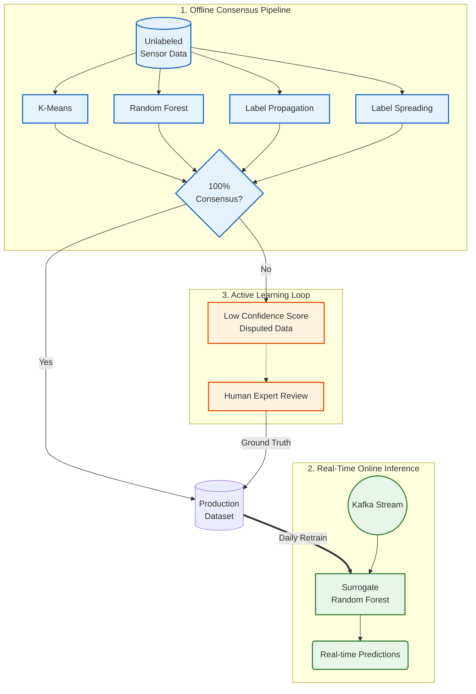
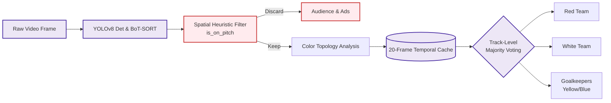

# Machine Learning & Computer Vision Portfolio

  
  
  
  

This repository contains end-to-end Machine Learning and Computer Vision projects. It demonstrates problem-solving under data constraints and scalable deployment architectures.

---

## 1. Sensor Anomaly Detection
**Focus**: Semi-Supervised Learning | Active Learning | System Architecture  
**Directory**: [`sensor_anomaly_detection/`](./sensor_anomaly_detection/)

### The Challenge
In specific industrial use cases, collecting sensor data is accessible, but labeling it requires domain experts. In this project, **2.5% of the data was labeled**. The goal was to build a classifier using this limited supervision.

### The Solution: Active Learning Data Flywheel
A multi-model consensus pipeline is used to scale labels for high-confidence data, routing low-confidence edge cases to domain experts for manual review.

### Key Components
1. **Automated Label Scaling:** Uses a 4-model consensus to generate pseudo-labels, progressively expanding the training set.
2. **Optimized Inference:** Graph-based models (Label Propagation) are kept offline. A Random Forest model is trained on the expanded dataset and deployed to handle Kafka streams.
3. **Active Learning:** Extracts low-confidence edge cases based on model agreement, routing them for manual expert review.

---

## 2. Sports Player Tracking & Analytics
**Focus**: Computer Vision | Multi-Object Tracking | Temporal Smoothing  
**Directory**: [`sports_player_tracking/`](./sports_player_tracking/)

### The Challenge
Tracking and classifying players and referees in sports broadcasts featuring moving cameras, motion blur, and occlusion.

### The Solution: YOLOv8 + BoT-SORT + Consensus Voting
A tracking pipeline designed to achieve stable team classification across consecutive frames.

### Key Components
1. **Filtering:** An `is_on_pitch` heuristic filter to omit bounding boxes corresponding to audience members and visual artifacts.
2. **Track-Level Voting Mechanism:** A temporal history buffer maintains classifications over a 20-frame window. Results are determined by track-level majority voting to reduce frame-to-frame flickering.
3. **Color-Based Classification:** An HSV and BGR clustering system to differentiate team colors and goalkeeper kits.
4. **Hardware Portability:** Code structured to support edge deployment, with portability to TensorRT or Quantized INT8/FP16 formats.

---

## 3. Deployment Strategy

The repository includes a deployment architecture utilizing Docker and Serverless technologies.

### A. Containerized Microservices
Each component can be independently containerized:
- **Offline Consensus Factory (`sensor_anomaly_detection/Dockerfile`)**: Packaged as a batch job. It can be orchestrated via **Apache Airflow** or **Kubernetes CronJobs** to pull unlabeled data, run the 4-model consensus voting, and update the dataset.
- **Online Surveillance Engine (`sports_player_tracking/Dockerfile`)**: An inference container with OpenCV and Ultralytics dependencies, designed to consume RTSP/Kafka video streams.

### B. Serverless Execution
- **AWS Lambda / GCP Cloud Functions:** The Random Forest model from the Sensor Anomaly project can be packaged with a FastAPI wrapper inside a Lambda function for scalable event-driven processing.
- **AWS SageMaker Asynchronous Inference:** The Sports Tracking YOLO pipeline can be deployed as an autoscaling SageMaker endpoint, provisioning GPU instances during active processing.
